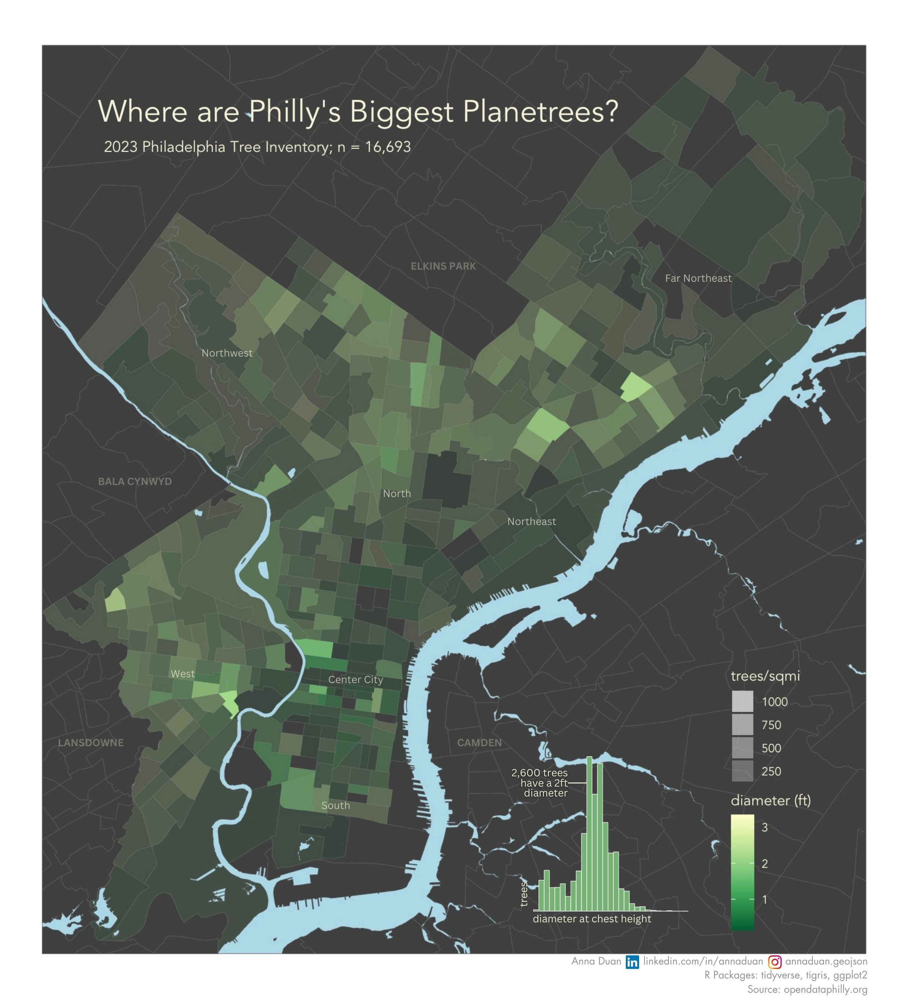

# MUSA Brownbag Lunch Demo: Map Design in R
### February 28, 2024
#### By: Anna Duan
#### Data: OpenDataPhilly.org



## Introduction  
This repository contains the materials for the "Map Design in R" tutorial presented at the MUSA Brownbag Lunch on February 28, 2024. The tutorial utilizes tree inventory data from the Philadelphia Parks and Recreation (PPR) Department, available through [OpenDataPhilly](https://opendataphilly.org/datasets/philadelphia-tree-inventory/), to create a comprehensive map of Philadelphia. The map showcases the distribution of tree diameter at breast height (DBH) across the city, incorporating additional geographic layers such as census tracts and primary/secondary roads to enrich the visualization.

## Objective
The main goal of this tutorial is to demonstrate how to use R and its spatial data manipulation and visualization packages to:
- Read and transform geographic data.
- Overlay multiple spatial layers to create a detailed basemap.
- Visualize continuous spatial data.
- Customize map aesthetics and legends to convey information effectively.

## Setup
Before starting, ensure you have R and RStudio installed. The following R packages are required:
- `tidyverse` for data manipulation and ggplot2 graphics.
- `tigris` for accessing geographic boundaries and features.
- `sf` for handling spatial data.
- `mapview` for interactive map viewing (optional for this tutorial but useful for exploration).

You can install these packages using the following commands:
```r
install.packages(c("tidyverse", "tigris", "sf", "mapview"))
```
